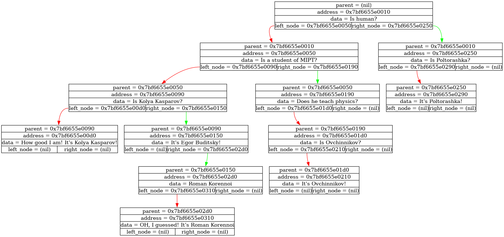

# Akinator(Trees)


## 📖 About the Project

**Trees** are very famous and important structure in the modern programming. The concept of a "Tree" involves organizing a container in the form of linked blocks, each of which stores information about its "children" and "parent". The aim of this project was to study some basic methods of working with trees and also to better hone your graphviz skills.

## Legend of inspiration

**What is Akinator?** It's one of the most famous game in the last ten years. The point of the game is that the system asks the user questions to which he can answer **Yes** or **No**. Thus, the program tries to guess who or what the user is thinking about. And the principle of operation of the Akinator is really based on the use of trees.

---

## ✨ Features

* 📂 Reads and processes **.json** files with trees
* 🔤 Use basic structure of tree and its methods
* 🔁 Supports **different** start data
* ⚡  Use Graphziv for visualization of tree

---

## 🛠 Technologies Used

* **C**
* **g++**
* **Makefile**
* **Standard Library**
* **Graphviz**


---

## 📂 Project Structure

```
Trees/
│
├── dump/           # pictures with trees
├── source/         # Source files
├── include/        # Header files
├── build/          # Compiled binaries
├── Makefile        # Build configuration
└── README.md
```

---

## Learn more about the principle of operation

So, from the file ``tree.json``, which located in the folder ``source``, program creates tree of questions and answers. Every bucket contains information about:
```
1. Address of parent bucket
2. Address of bucket
3. Data(question or answer)
4. Addresses of children
```

The format ``.json`` is used to simplify the program's perception of the input. So, if you want to create your own tree, you need to follow some rules:

1. You need to use **{}** for branches of each new tree level.
2. All data only in **""**!
3. You should not have empty leaves.

Example of tree(tree.json):
```
{
"Is human?"
    {
        "Is a student of MIPT?"
        {
            "Is Kolya Kasparov?"
            {
                "How good I am! It's Kolya Kasparov!"
            }
            {
                "It's Egor Buditsky!"
            }
        }
        {
            "Does he teach physics?"
            {
                "Is Ovchinnikov?"
                {
                    "It's Ovchinnikov!"
                }
            }
        }
    }
    {
        "Is Poltorashka?"
        {
            "It's Poltorashka!"
        }
    }
}

```

Of course, if program fails to guess your request, it will ask you to enter your answer for improving the data base.

### Some visualization



---
## ⚙️ Build and Run


### Clone the repository

```bash
git clone https://github.com/ZEVS1206/Trees.git
cd Trees
```

### Prepare your tree or use default
You can change the file ``tree.json``. **IT'S IMPORTANT FILE, DON'T REMOVE IT**

### Build the project

```bash
make clean
make
```

### Run

```bash
make run
```

---

## 📚 Educational Purpose

This project was created as part of a programming course to practice:

* skills of working with trees
* knowledge of C-language
* using of graphviz
* prepare for the next great project:)

---

## 📄 License

This project is licensed under the **MIT License**.

---

## 👨‍💻 Author

This project is a part of [Ilya Dedinskiy's](https://vk.com/ded32_ru) course of C-language!

Created by [Zevs](https://github.com/ZEVS1206)
